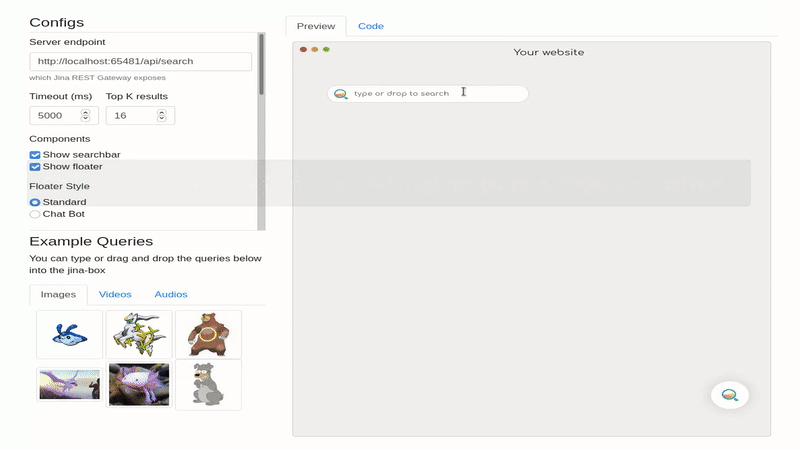
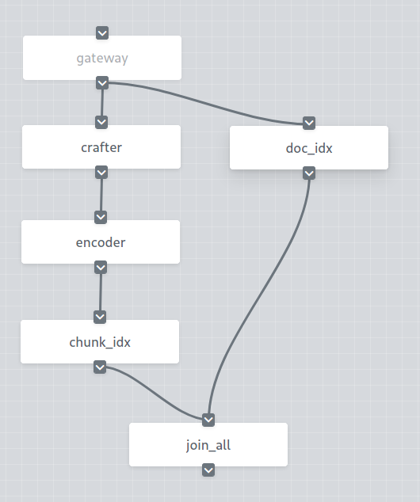
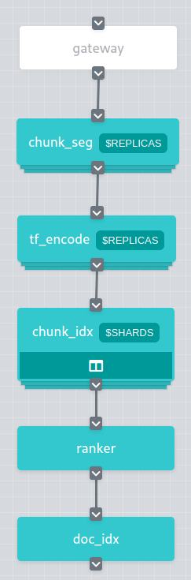

# Build a BERT-based Semantic Search System...For Star Trek

## It's search Jim, but not as we know it

If you read my [previous article on Towards Data Science](https://towardsdatascience.com/gpt-3-is-the-future-but-what-can-nlp-do-in-the-present-7aae3f21e8ed) you'll know I'm a bit of a Star Trek nerd. There's only one thing I like more than Star Trek, and that's building cool new stuff with AI. So I thought I'd combine the two yet again!

In this tutorial we're going to build our own search engine to search all the lines from *Star Trek: The Next Generation*. We'll be using [Jina](https://github.com/jina-ai/jina/), a neural search framework which uses deep learning to power the our NLP search, though we could easily use it for image, audio or video search if we wanted to.

We'll cover:

* Basic setup
* Running a demo of our app (yes, even before we code it)
* Using cookiecutter to create project and boilerplate code
* Downloading our dataset
* Loading, indexing, and searching our dataset
* A deeper look behind the scenes
* What to do if things go wrong

If you're new to AI or search, don't worry. As long as you have some knowledge of Python and the command line you'll be fine. If it helps, think of yourself as Lieutenant Commander Data Science.


# Try it Out!

Before going through the trouble of downloading, configuring and testing your search engine, let's get an idea of the finished product. In this case, it's exactly the same as what we're building, but with lines from South Park instead of Star Trek:


Jina has a pre-built Docker image with indexed data from South Park. You can run it with:

```bash
docker run -p 45678:45678 jinaai/hub.app.distilbert-southpark
```

After getting Docker up and running, you can start searching for those South Park lines.

## Query with Jinabox

[Jinabox](https://github.com/jina-ai/jinabox.js/) is a simple web-based front-end for neural search. You can see it in the graphic at the top of this tutorial.

1. Go to [jinabox](https://jina.ai/jinabox.js) in your browser
2. Ensure you have the server endpoint set to `http://localhost:45678/api/search`
3. Type a phrase into the search bar and see which South Park lines come up

**Note:** If it times out the first time, that's because the query system is still warming up. Try again in a few seconds!

## Query with `curl`

Alternatively, you can open your shell and check the results via the RESTful API. The matched results are stored in `topkResults`.

```bash
curl --request POST -d '{"top_k": 10, "mode": "search", "data": ["text:hey, dude"]}' -H 'Content-Type: application/json' 'http://0.0.0.0:45678/api/search'
```

You'll see the results output in JSON format. Each result looks like:

```json  
{
            "matchDoc": {
              "docId": 48,
              "weight": 1.0,
              "mimeType": "text/plain",
              "text": "Cartman[SEP]Hey, hey, did you see my iPad, Token?\n"
            },
            "score": {
              "value": 0.29252166,
              "opName": "MinRanker"
            }
          },
```

Now go back to your terminal and hit `Ctrl-C` (or `Command-C` on Mac) a few times to ensure you've stopped Docker.

# Install

Now that you know what we're building, let's get started!

## You Will Need

* A basic knowledge of Python
* Python 3.7 or higher installed, and `pip`
* A Mac or Linux computer (Jina doesn't currently support Windows)
* 8 gigabytes or more of RAM

## Clone the Repo

Let's get the basic files we need to get moving:

```shell
git clone git@github.com:alexcg1/my-first-jina-app.git
cd my-first-jina-app
```

## Run Cookiecutter


```shell
pip install -U cookiecutter && cookiecutter gh:jina-ai/cookiecutter-jina
```

We use [cookiecutter](https://github.com/cookiecutter/cookiecutter) to spin up a basic Jina app and save you having to do a lot of typing and setup. 

For our Star Trek example, use the following settings:

* `project_name`: `Star Trek`
* `project_slug`: `star_trek` (default value)
* `task_type`: `nlp`
* `index_type`: `strings`
* `public_port`: `65481` (default value)

Just use the defaults for all other fields.

Let's have a look at the files cookiecutter creates for us:

```sh
cd star_trek
ls
```

You should see a bunch of files:

* `app.py`           - The main Python script where you initialize and pass data into your Flow 
* `Dockerfile`       - Lets you spin up a Docker instance running your app                      
* `flows/`           - Folder to hold your Flows                                                
* `pods/`            - Folder to hold your Pods                                                 
* `README.md`        - An auto-generated README file                                            
* `requirements.txt` - A list of required Python packages                                       

In the `flows/` folder we can see `index.yml` and `query.yml` - these define the indexing and querying Flows for your app.

In `pods/` we see `chunk.yml`, `craft.yml`, `doc.yml`, and `encode.yml` - these Pods are called from the Flows to process data for indexing or querying.

More on Flows and Pods later!

## Install Requirements

In your terminal:

```sh
pip install -r requirements.txt
```

## Download Dataset

Our goal is to find out who said what in Star Trek episodes when a user queries a phrase. The [Star Trek dataset](https://www.kaggle.com/gjbroughton/start-trek-scripts) from Kaggle contains all the scripts and individual character lines from *Star Trek: The Original Series* all the way through *Star Trek: Enterprise*. 

We're just using a subset in this example, containing the characters and lines from *Star Trek: The Next Generation*. This has also been converted from JSON to CSV format, which is more suitable for Jina to process.

Now let's ensure we're back in our base folder and download the dataset by running:

```bash
cd ..
bash ./get_data.sh
```

Once that's finished downloading, let's get back into the `star_trek` directory and make sure our dataset has everything we want:

```shell
cd star_trek
head data/startrek_tng.csv
```

You should see output consisting of characters (like `MCCOY`), a separator, (`!`), and the lines spoken by the character (`What about my age?`):

```csv
BAILIFF!The prisoners will all stand.
BAILIFF!All present, stand and make respectful attention to honouredJudge.
BAILIFF!Before this gracious court now appear these prisoners toanswer for the multiple and grievous savageries of their species. Howplead you, criminal?
BAILIFF!Criminals keep silence!
BAILIFF!You will answer the charges, criminals.
BAILIFF!Criminal, you will read the charges to the court.
BAILIFF!All present, respectfully stand. Q
BAILIFF!This honourable court is adjourned. Stand respectfully. Q
MCCOY!Hold it right there, boy.
MCCOY!What about my age?
```

Note: Your character lines may be a little different. That's okay!

## Load Data

Now we we need to pass `startrek_tng.csv` into `app.py` so we can index it. `app.py` is a little too simple out of the box, so let's make some changes:

Open `app.py` in your editor and check the `index` function, we currently have:

```python
def index():
    with f:
        f.index_lines(['abc', 'cde', 'efg'], batch_size=64, read_mode='r', size=num_docs)
```

As you can see, this indexes just 3 strings. Let's load up our Star Trek file instead with the `filepath` parameter. Just replace the last line of the function:

```python
def index():
    with f:
        f.index_lines(filepath='data/startrek_tng.csv', batch_size=64, read_mode='r', size=num_docs)
```

## Index Fewer Documents

While we're here, let's reduce the number of documents we're indexing, just to speed things up while we're testing. We don't want to spend ages indexing only to have issues later on!

In the section above the `config` function, let's change:

```python
num_docs = os.environ.get('MAX_DOCS', 50000)
```

to:

```python
num_docs = os.environ.get('MAX_DOCS', 500)
```

That should speed up our testing by a factor of 100! Once we've verified everything works we can set it back to `50000` to index more of our dataset. 

Now that we've got the code to load our data, we're going to dive into writing our app and running our Flows! Flows are the different tasks our app performs, like indexing or searching the data.

## Indexing

First up we need to build up an index of our file. We'll search through this index when we use the query Flow later.

```bash
python app.py index
```

Your app will show a lot of output in the shell, but you'll know it's finished when you see the line:

```console
Flow@133216[S]:flow is closed and all resources should be released already, current build level is 0
```

This may take a little while the first time, since Jina needs to download the language model and tokenizer to process the data. You can think of these as the brains behind the neural network that powers the search.

## Searching

Run:

```bash
python app.py search
```

After a while you should see the console stop scrolling and display output like:

```console
Flow@85144[S]:flow is started at 0.0.0.0:65481, you can now use client to send request!
```

⚠️  Be sure to note down the port number. We'll need it for `curl` and jinabox! In our case we'll assume it's `65481`, and we use that in the below examples. If your port number is different, be sure to use that instead.

ℹ️  `python app.py search` doesn't pop up a search interface - for that you'll need to connect via `curl`, Jinabox, or another client.

## Search with Jinabox


 
1. Go to [jinabox](https://jina.ai/jinabox.js) in your browser
2. Ensure you have the server endpoint set to `http://localhost:65481/api/search`
3. Type a phrase into the search bar and see which Star Trek lines come up

## Search with Curl

`curl` will spit out a *lot* of information in JSON format - not just the lines you're searching for, but all sorts of metadata about the search and the lines it returns. Look for the lines starting with `"matchDoc"` to find the matches.

```bash
curl --request POST -d '{"top_k": 10, "mode": "search", "data": ["text:picard to riker"]}' -H 'Content-Type: application/json' 'http://0.0.0.0:65481/api/search'
```

You should see a lot of console output, but each result will will look similar to:

```json
{
            "matchDoc": {
              "docId": 421,
              "weight": 1.0,
              "mimeType": "text/plain",
              "text": "WORF!Vessel unknown, configuration unknown, sir.\n"
            },
            "score": {
              "value": 0.748656,
              "opName": "BiMatchRanker"
            }
          },
```

Congratulations! You've just built your very own search engine!

# How Does it Actually Work?

For a more general overview of what neural search is and how it works, check one of [my other previous articles](https://towardsdatascience.com/what-is-neural-search-and-why-should-i-care-4a6cee6b2249). Jina itself is just one way to build a neural search engine, and has a couple of important concepts: **Flows** and **Pods**:

* The Flow tells Jina *what* tasks to perform on the dataset, like indexing or searching. Each Flow is built from individual Pods.
* The Pods comprise the Flow and tell Jina *how* to perform each task step by step, like breaking text into chunks, indexing it, and so on. They define the actual neural networks we use in neural search, namely the language models like `distilbert-base-cased`. (Which we can see in `pods/encode.yml`)

## Flows


Just as a plant manages nutrient flow and growth rate for its branches, a Flow manages the states and context of a group of Pods, orchestrating them to accomplish one task. Whether a Pod is remote or running in Docker, one Flow rules them all!

We define Flows in `app.py` to index and query the content in our Star Trek dataset.

In this case our Flows are written in YAML format and loaded into `app.py` with:

```python
from jina.flow import Flow

<other code here>

def index():
    f = Flow.load_config('flows/index.yml')
```

It really is that simple! Alternatively you can build Flows in `app.py` itself [without specifying them in YAML](https://docs.jina.ai/chapters/flow/index.html).

No matter whether you're dealing with text, graphics, sound, or video, all datasets need to be indexed and queried, and the steps for doing each (chunking, vector encoding) are more or less the same (even if *how* you perform each step is different - that's where Pods come in!)

## Indexing

Every Flow has well, a flow to it. Different Pods pass data along the Flow, with one Pod's output becoming another Pod's input. Look at our indexing Flow as an example:

<p align="center">

</p>

If you look at `startrek_tng.csv` you'll see it's just one big text file. Our Flow processes it into something more suitable for Jina, which is handled by the Pods in the Flow. Each Pod performs a different task.

You can see the following Pods in `flows/index.yml`:

* `crafter`       - Split the Document into Chunks                       
* `encoder`       - Encode each Chunk into a vector                      
* `chunk_idx`     - Build an index of Chunks                             
* `doc_idx`       - Store the Document content                           
* `join_all`      - Join the `chunk_idx` and `doc_idx` pathways          

The full file is essentially just a list of Pods with parameters and some setup at the top of the file:

```yaml
!Flow
with:
  logserver: true
pods:
  crafter:
    yaml_path: pods/craft.yml
    read_only: true
  encoder:
    yaml_path: pods/encode.yml
    replicas: $REPLICAS
    timeout_ready: 600000
    read_only: true
  chunk_idx:
    yaml_path: pods/chunk.yml
    replicas: $SHARDS
    separated_workspace: true
  doc_idx:
    yaml_path: pods/doc.yml
    needs: gateway
  join_all:
    yaml_path: _merge
    needs: [doc_idx, chunk_idx]
```

Luckily, YAML is pretty human-readable. Be grateful it's not in Klingon, or even worse, XML!

* The first couple of lines initialize the Flow and enable the logserver (which we're not using in this tutorial).
* After that we can see the list of Pods, with their own YAML path and extra parameters being passed to each one. 

So, is that all of the Pods? Not quite! We always have another Pod working in silence - the `gateway` pod. Most of the time we can safely ignore it because it basically does all the dirty orchestration work for the Flow.

### Querying



In the query Flow we've got the following Pods:

* `chunk_seg`     - Segments the user query into meaningful Chunks       
* `tf_encode`     - Encode each word of the query into a vector          
* `chunk_idx`     - Build an index for the Chunks for fast lookup        
* `ranker`        - Sort results list                                    
* `doc_idx`       - Store the Document content                           

Again, `flows/query.yml` gives some setup options and lists the Pods in order of use:

```yaml
!Flow
with:
  read_only: true  # better add this in the query time
  rest_api: true
  port_expose: $JINA_PORT
pods:
  chunk_seg:
    yaml_path: pods/craft.yml
    replicas: $REPLICAS
  tf_encode:
    yaml_path: pods/encode.yml
    replicas: $REPLICAS
    timeout_ready: 600000
  chunk_idx:
    yaml_path: pods/chunk.yml
    replicas: $SHARDS
    separated_workspace: true
    polling: all
    reducing_yaml_path: _merge_topk_chunks
    timeout_ready: 100000 # larger timeout as in query time will read all the data
  ranker:
    yaml_path: BiMatchRanker
  doc_idx:
    yaml_path: pods/doc.yml
```

When we were indexing we broke the Document into Chunks to index it. For querying we do the same, but this time the Document is the query the user types in, not the Star Trek dataset. We'll use many of the same Pods, but there are a few differences to bear in mind. In the big picture:

* Index has a two-pathway design which deals with both Document and Chunk indexing in parallel, which speeds up message passing
* Query has a single pipeline

And digging into the `flows/query.yml`, we can see it has an extra Pod and some more parameters compared to `flows/index.yml`:

* `rest_api:true`                          - Use Jina's REST API, allowing clients like jinabox and `curl` to connect 
* `port_expose: $JINA_PORT`                - The port for connecting to Jina's API                                    
* `polling: all`                           - Setting `polling` to `all` ensures all workers poll the message          
* `reducing_yaml_path: _merge_topk_chunks` - Use `_merge_topk_chunks` to reduce results from all replicas              
* `ranker:`                                - Rank results by relevance                                       

How does Jina know whether it should be indexing or searching? In our RESTful API we set the `mode` field in the JSON body and send the request to the corresponding API:

* `api/index`  - `{"mode": "index"}`  
* `api/search` - `{"mode": "search"}` 

## Pods


As we discussed above, a Flow tells Jina *what* task to perform and is comprised of Pods. And a Pod tells Jina *how* to perform that task (i.e. which is the right tool for the job?). Both Pods and Flows are written in YAML.

Let's start by looking at a Pod in our indexing Flow, `flows/index.yml`. Instead of the first Pod `crafter`, let's look at `encoder` which is a bit simpler:

```yaml
pods:

  <other pods here>

  encoder:
    yaml_path: pods/encode.yml
    replicas: $REPLICAS
    timeout_ready: 600000
    read_only: true
```

As we can see, the Pod's YAML file is stored in `pods/encode.yml`:

```yaml
!TransformerTorchEncoder
with:
  pooling_strategy: cls
  model_name: distilbert-base-cased
  max_length: 96
```

We first use the built-in `TransformerTorchEncoder` as the Pod's Executor. Each Pod has a different Executor based on its task, and an Executor represents an algorithm, in this case encoding. The Executor differs based on what's being encoded. For video or audio you'd use a different one. The `with` field specifies the parameters we pass to `TransformerTorchEncoder`.

* `pooling_strategy` - Strategy to merge word embeddings into chunk embedding 
* `model_name`       - Name of the model we're using                          
* `max_length`       - Maximum length to truncate tokenized sequences to      

When the Pod runs, data is passed in from the previous Pod, `TransformerTorchEncoder` encodes the data, and the Pod passes the data to the next Pod in the Flow.

# Troubleshooting

## Module not found error

Be sure to run `pip install -r requirements.txt` before beginning, and ensure you have lots of RAM/swap and space in your `tmp` partition (see below issues). This may take a while since there are a lot of prerequisites to install.

If this error keeps popping up, look into the error logs to try to find which module it's talking about, and then run:

```sh
pip install <module_name>
```

## My Computer Hangs

Machine learning requires a lot of resources, and if your machine hangs this is often due to running out of memory. To fix this, try [creating a swap file](https://linuxize.com/post/how-to-add-swap-space-on-ubuntu-20-04/) if you use Linux. This isn't such an issue on macOS, since it allocates swap automatically.

## `ERROR: Could not install packages due to an EnvironmentError: [Errno 28] No space left on device`

This is often due to your `/tmp` partition running out of space so you'll need to [increase its size](https://askubuntu.com/questions/199565/not-enough-space-on-tmp).

## `command not found`

For any of these errors you'll need to install the relevant software package onto your system. In Ubuntu this can be done with:

```sh
sudo apt-get install <package_name>
```

## 🎁 Congratulations! We Did It!


In this tutorial you've learned:

* How to install the Jina neural search framework
* How to load and index text data from files
* How to query data with `curl` and Jinabox
* The nitty-gritty behind Jina Flows and Pods
* What do if it all goes wrong

Now that you have a broad understanding of how things work, you can try out some of more [example tutorials](https://github.com/jina-ai/examples) to build image or video search, or stay tuned for our next set of tutorials that build upon your Star Trek app. Got an idea for a tutorial covering Star Trek and/or neural search? My commbadge is out of order right now, but you can leave a comment on this article for me to assimilate!
